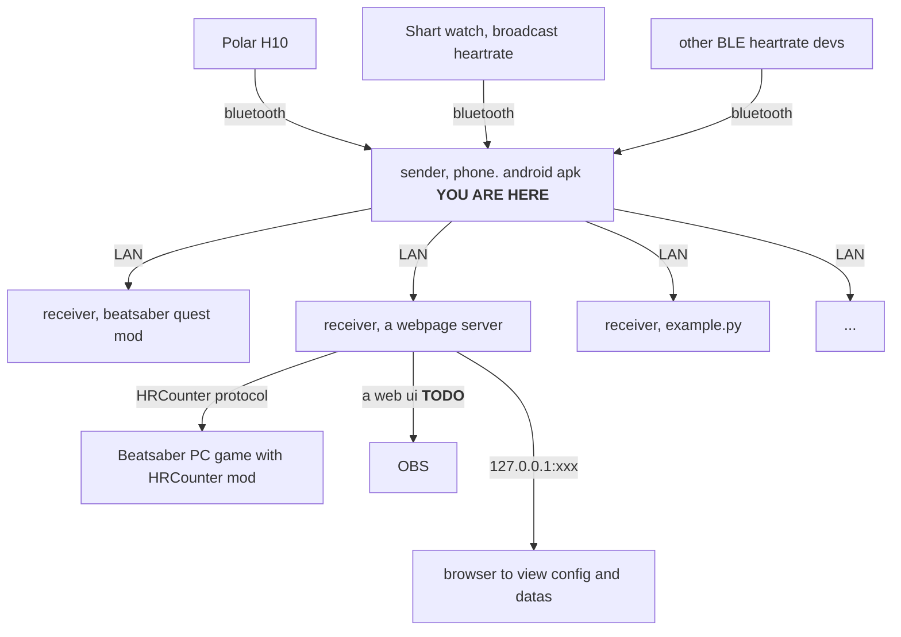

# HearbeatLanSender

Send heartrate via UDP LAN from your android phone.

Download software [here](https://github.com/frto027/HeartbeatLanServer/releases/latest).

This app can be installed to your Oculus quest headset, and it will only send data to the headset itself instad of lan by default.

在[这里](https://github.com/frto027/HeartbeatLanServer/releases/latest)下载最新版本的apk。

- [receiver, example.py](script/client_example.py)
- [receiver, a webpage server](https://github.com/frto027/HeartbeatLanClient) It is also possible to read heartbeat data from this receiver via http protocol.
- [receiver, beatsaber quest mod](https://github.com/frto027/HeartBeatLanClientBSQuest)

# Protocol

[UDP Protocol](Protocol.md)

[UDP协议文档](./script/Readme.md)
